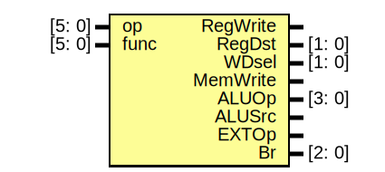

# Entity: CTRL 

- **File**: CTRL.v
## Diagram

## Ports

| Port name | Direction | Type   | Description           |
| --------- | --------- | ------ | --------------------- |
| op        | input     | [5: 0] | Opcode                |
| func      | input     | [5: 0] | Function              |
| RegWrite  | output    |        | Register Write Enable |
| RegDst    | output    | [1: 0] | Register Destination  |
| WDsel     | output    | [1: 0] | Write Data Select     |
| MemWrite  | output    |        | Memory Write Enable   |
| ALUOp     | output    | [3: 0] | ALU Operation         |
| ALUSrc    | output    |        | ALU Source Select     |
| EXTOp     | output    |        | Extend Operation      |
| Br        | output    | [2: 0] | Branch Control        |
## Signals

| Name  | Type | Description       |
| ----- | ---- | ----------------- |
| R     | wire | R-Type            |
| store | wire | Store Instruction |
| load  | wire | Load Instruction  |
| link  | wire | Link Instruction  |
