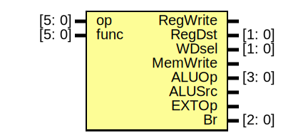
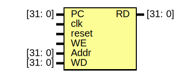
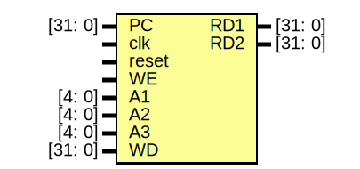
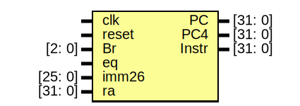
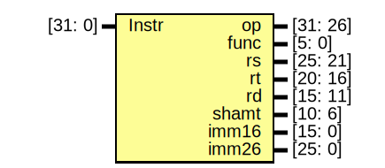

# 设计文档

## 设计概述

- 处理器为 32 位单周期处理器，不考虑延迟槽，应支持的指令集为：`add, sub, ori, lw, sw, beq, lui, jal, jr, nop`，其中：
  - `nop` 为空指令，机器码 `0x00000000`，不进行任何有效行为（修改寄存器等）。
  - `add, sub` 按无符号加减法处理（不考虑溢出）。
- 采用模块化和层次化设计。顶层文件为 mips.v，有效的驱动信号包括且仅包括同步复位信号 reset 和时钟信号 clk，接口定义如下：

```verilog
module mips(
    input clk,
    input reset
);
```

## Module

### Entity: ALU

- **File**: ALU.v

#### Diagram


#### Ports

| Port name | Direction | Type    | Description   |
| --------- | --------- | ------- | ------------- |
| ALUOp     | input     | [3: 0]  | ALU Operation |
| A         | input     | [31: 0] | Input A       |
| B         | input     | [31: 0] | Input B       |
| shamt     | input     | [5: 0]  | Shift Amount  |
| ALUout    | output    | [31: 0] | ALU Output    |

### Entity: CTRL

- **File**: CTRL.v

#### Diagram



#### Ports

| Port name | Direction | Type   | Description           |
| --------- | --------- | ------ | --------------------- |
| op        | input     | [5: 0] | Opcode                |
| func      | input     | [5: 0] | Function              |
| RegWrite  | output    |        | Register Write Enable |
| RegDst    | output    | [1: 0] | Register Destination  |
| WDsel     | output    | [1: 0] | Write Data Select     |
| MemWrite  | output    |        | Memory Write Enable   |
| ALUOp     | output    | [3: 0] | ALU Operation         |
| ALUSrc    | output    |        | ALU Source Select     |
| EXTOp     | output    |        | Extend Operation      |
| Br        | output    | [2: 0] | Branch Control        |

#### Signals

| Name  | Type | Description       |
| ----- | ---- | ----------------- |
| R     | wire | R-Type            |
| store | wire | Store Instruction |
| load  | wire | Load Instruction  |
| link  | wire | Link Instruction  |

### Entity: DM

- **File**: DM.v

#### Diagram



#### Ports

| Port name | Direction | Type    | Description     |
| --------- | --------- | ------- | --------------- |
| PC        | input     | [31: 0] | Program Counter |
| clk       | input     |         | Clock           |
| reset     | input     |         | Reset           |
| WE        | input     |         | Write Enable    |
| Addr      | input     | [31: 0] | Address         |
| WD        | input     | [31: 0] | Write Data      |
| RD        | output    | [31: 0] | Read Data       |

#### Signals

| Name | Type        | Description   |
| ---- | ----------- | ------------- |
| DM   | reg [31: 0] | Data Memory   |
| i    | integer     | Loop Variable |

#### Processes

- MemWrite: ( @(posedge clk) )
  - **Type:** always

### Entity: EXT

- **File**: EXT.v

#### Diagram


#### Ports

| Port name | Direction | Type    | Description       |
| --------- | --------- | ------- | ----------------- |
| imm16     | input     | [15: 0] | Immediate 16 bits |
| EXTOp     | input     |         | Extend Operation  |
| imm32     | output    | [31: 0] | Immediate 32 bits |

### Entity: GRF

- **File**: GRF.v

#### Diagram



#### Ports

| Port name | Direction | Type    | Description     |
| --------- | --------- | ------- | --------------- |
| PC        | input     | [31: 0] | Program Counter |
| clk       | input     |         | Clock           |
| reset     | input     |         | Reset           |
| WE        | input     |         | Write Enable    |
| A1        | input     | [4: 0]  | Register A1     |
| A2        | input     | [4: 0]  | Register A2     |
| A3        | input     | [4: 0]  | Register A3     |
| WD        | input     | [31: 0] | Write Data      |
| RD1       | output    | [31: 0] | Read Data 1     |
| RD2       | output    | [31: 0] | Read Data 2     |

#### Signals

| Name | Type        | Description   |
| ---- | ----------- | ------------- |
| RF   | reg [31: 0] | Register File |
| i    | integer     | Loop Variable |

#### Processes

- RegWrite: ( @(posedge clk) )
  - **Type:** always

### Entity: IFU 

- **File**: IFU.v

#### Diagram



#### Ports

| Port name | Direction | Type    | Description                  |
| --------- | --------- | ------- | ---------------------------- |
| PC        | output    | [31: 0] | Program Counter              |
| clk       | input     |         | Clock                        |
| reset     | input     |         | Reset                        |
| Br        | input     | [2: 0]  | Branch Control               |
| eq        | input     |         | Equal Flag                   |
| imm26     | input     | [25: 0] | Immediate 26 bits or 16 bits |
| ra        | input     | [31: 0] | Register                     |
| PC4       | output    | [31: 0] | Program Counter + 4          |
| Instr     | output    | [31: 0] | Instruction                  |
#### Signals

| Name | Type         | Description |
| ---- | ------------ | ----------- |
| nPC  | wire [31: 0] | Next PC     |

#### Processes

- PC_Update: ( @(posedge clk) )
  - **Type:** always

#### Instantiations

- IM: IM

### Entity: IM

- **File**: IFU.v

#### Diagram


#### Ports

| Port name | Direction | Type    | Description     |
| --------- | --------- | ------- | --------------- |
| PC        | input     | [31: 0] | Program Counter |
| Instr     | output    | [31: 0] | Instruction     |

#### Signals

| Name   | Type         | Description        |
| ------ | ------------ | ------------------ |
| IM     | reg [31: 0]  | Instruction Memory |
| PC3000 | wire [31: 0] | PC - 3000          |


### Entity: SPLT

- **File**: SPLT.v

#### Diagram



#### Ports

| Port name | Direction | Type     | Description          |
| --------- | --------- | -------- | -------------------- |
| Instr     | input     | [31: 0]  | Instruction          |
| op        | output    | [31: 26] | Opcode               |
| func      | output    | [5: 0]   | Function             |
| rs        | output    | [25: 21] | Source Register 1    |
| rt        | output    | [20: 16] | Source Register 2    |
| rd        | output    | [15: 11] | Destination Register |
| shamt     | output    | [10: 6]  | Shift Amount         |
| imm16     | output    | [15: 0]  | Immediate 16 bits    |
| imm26     | output    | [25: 0]  | Immediate 26 bits    |

## 测试方案

采用编写的自动生成测试用例的程序生成测试用例，然后用iverilog进行仿真，并利用讨论区中石睿知同学分享的魔改版Mars进行自动化比对。

## 思考题

### 1.阅读下面给出的 DM 的输入示例中（示例 DM 容量为 4KB，即 32bit × 1024字），根据你的理解回答，这个 addr 信号又是从哪里来的？地址信号 addr 位数为什么是 [11:2] 而不是 [9:0] ？

addr来自ALU的输出，代表要读取的DM存储器的地址。

MIPS中以字节为单位，而在DM中以32位register，即word为单位。

### 2.思考上述两种控制器设计的译码方式，给出代码示例，并尝试对比各方式的优劣

- 记录指令对应的控制信号如何取值

    ```verilog
    always@(*)begin
        case(op) begin
            `ALU_Rtype: begin
                case(func) begin
                    `FUNC_sub: begin
                        ALUOp = `ALU_sub;
                        ALUSrc = `ALU_RD2;
                    end
                    default: begin
                        ALUOp = `ALU_add;
                        ALUSrc = `ALU_RD2;
                    end
                endcase
            default: begin
                ALUOp = `ALU_add;
                ALUSrc = `ALU_imm;
            end
        endcase
    end
    ```

    根据输入的指令，记录对应的控制信号的取值。代码相对较为复杂但可读性更高，适合于指令之间的差异较大的情况，也更容易进行扩展。
- 记录控制信号每种取值所对应的指令
  
    ```verilog
    assign ALUOp =
           R ?
           (func == `FUNC_add) ? `ALU_add :
           (func == `FUNC_sub) ? `ALU_sub :
       `ALU_add :
           (op == `OP_beq) ? `ALU_sub :
           (op == `OP_ori) ? `ALU_or :
           (op == `OP_lui) ? `ALU_lui :
           `ALU_add;
    assign ALUSrc =
           R ? `ALU_RD2 :
           (Br == `Br_beq) ? `ALU_RD2 :
           `ALU_imm;
    ```

    根据控制信号的每种取值找到对应的指令。代码相对较为简介但可读性稍差，但在指令较多、指令具有相似性的情况下，可以显著减少代码量。

### 3.在相应的部件中，复位信号的设计都是同步复位，这与 P3 中的设计要求不同。请对比同步复位与异步复位这两种方式的 reset 信号与 clk 信号优先级的关系

- 同步复位：clk高于reset
- 异步复位：reset高于clk

### 4.C 语言是一种弱类型程序设计语言。C 语言中不对计算结果溢出进行处理，这意味着 C 语言要求程序员必须很清楚计算结果是否会导致溢出。因此，如果仅仅支持 C 语言，MIPS 指令的所有计算指令均可以忽略溢出。 请说明为什么在忽略溢出的前提下，addi 与 addiu 是等价的，add 与 addu 是等价的。提示：阅读《MIPS32® Architecture For Programmers Volume II: The MIPS32® Instruction Set》中相关指令的 Operation 部分

add指令的行为如下：

```verilog
temp <- {GPR[rs][31], GPR[rs][31:0]} + {GPR[rt][31], GPR[rt][31:0]}
if temp[32] != temp[31] then
    SignalException(IntegerOverflow)
else
    GPR[rd] <- temp
endif
```

而addu指令行为如下：

```verilog
temp <- GPR[rs] + GPR[rt]
GPR[rd] <- temp
```

addi与addiu类似

可知当且仅当出现溢出时，add(i)u与add(i)的行为不同

- add(i)u将溢出的最高位舍弃
- add(i)会报告SignalException(IntegerOverflow)

所以若忽略溢出，add(i)u与add(i)等价。
