# 设计文档

## 思考题

### 1 请查阅相关资料，说明鼠标和键盘的输入信号是如何被 CPU 知晓的？

鼠标和键盘的输入信号是通过中断的方式被 CPU 知晓的。

当外部设备（如鼠标或键盘）准备好传递信息给 CPU 时，它会向 CPU 发出中断请求。处理器收到中断请求后，它会暂停当前的工作，跳转到执行中断处理程序的地址。中断处理程序负责处理来自外部设备的信息，然后将控制权返回给处理器。

### 2、请思考为什么我们的 CPU 处理中断异常必须是已经指定好的地址？如果你的 CPU 支持用户自定义入口地址，即处理中断异常的程序由用户提供，其还能提供我们所希望的功能吗？如果可以，请说明这样可能会出现什么问题？否则举例说明。（假设用户提供的中断处理程序合法）

如果允许用户自定义入口地址，会出现以下问题：

- 安全风险：如果用户自定义的中断处理程序存在安全漏洞，那么可能会导致数据泄露、恶意代码执行等安全问题。
- 系统稳定性：如果用户自定义的中断处理程序不稳定，可能会导致系统崩溃或者其他故障。
- 可维护性：如果允许用户自定义中断处理程序，系统维护人员就无法确定该系统中有哪些中断处理程序，也无法保证这些程序的质量和稳定性。

### 3、为何与外设通信需要 Bridge？

使用 Bridge 连接 CPU 和外设可以提高计算机系统的性能和灵活性，因为它允许 CPU 和外设使用不同的总线进行通信，并且可以灵活地添加或删除外设。

### 4、请阅读官方提供的定时器源代码，阐述两种中断模式的异同，并分别针对每一种模式绘制状态移图

- Mode 0：产生定时中断。计时一次并于结束时产生中断信号，直到信号被相应。
  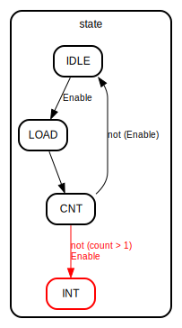
  
  同时在执行完成后将 Enable 置 0，返回 IDLE 态。
  
- Mode 1：产生周期中断。循环计时，结束时产生一周期的中断信号并进入新的计时。
  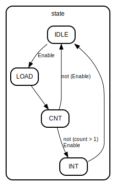

### 5、倘若中断信号流入的时候，在检测宏观 PC 的一级如果是一条空泡（你的 CPU 该级所有信息均为空）指令，此时会发生什么问题？在此例基础上请思考：在 P7 中，清空流水线产生的空泡指令应该保留原指令的哪些信息？

写入的 EPC 和 BD 信号均为空，中断返回的位置会出现问题。

需要保留其下一条指令的 EPC 和 BD。

### 6、为什么 `jalr` 指令为什么不能写成 `jalr $31, $31`？

因为需要保证在相同条件下多次执行同一个跳转指令，指令行为不变。

若相等，在`jalr`的延迟槽指令处产生了中断或异常，`jalr`的写入已经完成，返回时回到`jalr`，会导致跳转至错误的地址，即`jalr`写入的地址，也就是会无限循环。

## 设计概述

- MIPS 处理器为流水线设计，MIPS 微系统支持中断和异常。

## MODULE

### Entity: mips

- **File**: mips.v

#### Diagram

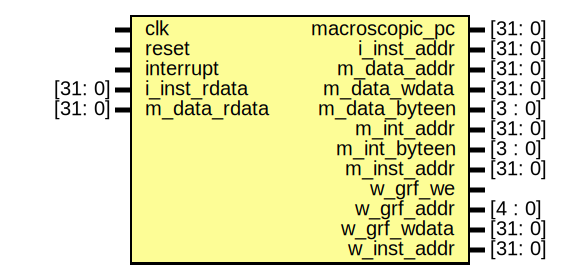

#### Ports

| Port name      | Direction | Type    | Description                  |
| -------------- | --------- | ------- | ---------------------------- |
| clk            | input     |         | Clock                        |
| reset          | input     |         | Reset                        |
| interrupt      | input     |         | Interrupt                    |
| macroscopic_pc | output    | [31: 0] | Macroscopic PC               |
| i_inst_addr    | output    | [31: 0] | Instruction Memory Address   |
| i_inst_rdata   | input     | [31: 0] | Instruction Memory Data      |
| m_data_addr    | output    | [31: 0] | Data Memory Address          |
| m_data_rdata   | input     | [31: 0] | Data Memory Data             |
| m_data_wdata   | output    | [31: 0] | Data Memory Write Data       |
| m_data_byteen  | output    | [3 : 0] | Data Memory Byte Enable      |
| m_int_addr     | output    | [31: 0] | Interrupt Memory Address     |
| m_int_byteen   | output    | [3 : 0] | Interrupt Memory Byte Enable |
| m_inst_addr    | output    | [31: 0] | Instruction Memory Address   |
| w_grf_we       | output    |         | GRF Write Enable             |
| w_grf_addr     | output    | [4 : 0] | GRF Write Address            |
| w_grf_wdata    | output    | [31: 0] | GRF Write Data               |
| w_inst_addr    | output    | [31: 0] | Instruction Memory Address   |

#### Instantiations

- CPU: CPU
- TC1: TC
- TC2: TC

### Entity: M_CP0

- **File**: M_CP0.v

#### Diagram

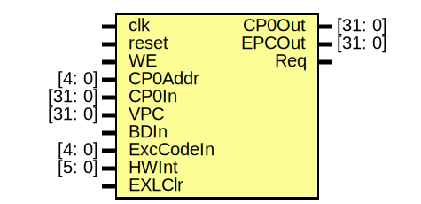

#### Ports

| Port name | Direction | Type    | Description        |
| --------- | --------- | ------- | ------------------ |
| clk       | input     |         | Clock              |
| reset     | input     |         | Reset              |
| WE        | input     |         | Write Enable       |
| CP0Addr   | input     | [4: 0]  | CP0 Address        |
| CP0In     | input     | [31: 0] | CP0 Input          |
| CP0Out    | output    | [31: 0] | CP0 Output         |
| VPC       | input     | [31: 0] | VPC                |
| BDIn      | input     |         | Branch Delay       |
| ExcCodeIn | input     | [4: 0]  | Exception Code     |
| HWInt     | input     | [5: 0]  | Hardware Interrupt |
| EXLClr    | input     |         | EXL Clear          |
| EPCOut    | output    | [31: 0] | EPC Output         |
| Req       | output    |         | Request            |

#### Processes

- unnamed: ( @(posedge clk or posedge reset) )
  - **Type:** always

### Entity: CU

- **File**: _CU.v

#### Diagram

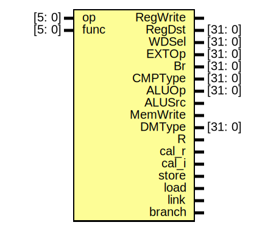

#### Ports

| Port name | Direction | Type    | Description                  |
| --------- | --------- | ------- | ---------------------------- |
| op        | input     | [5: 0]  | Instruction opcode           |
| func      | input     | [5: 0]  | Instruction function         |
| RegWrite  | output    |         | Write to register file       |
| RegDst    | output    | [31: 0] | Register destination         |
| WDSel     | output    | [31: 0] | Write data select            |
| EXTOp     | output    | [31: 0] | ALU operation                |
| Br        | output    | [31: 0] | Branch or Jump               |
| CMPType   | output    | [31: 0] | Branch type                  |
| ALUOp     | output    | [31: 0] | ALU operation                |
| ALUSrc    | output    |         | ALU source                   |
| MemWrite  | output    |         | Write to memory              |
| DMType    | output    | [31: 0] | MemoryWrite type             |
| R         | output    |         | R_Type instruction           |
| cal_r     | output    |         | Calculate R_Type instruction |
| cal_i     | output    |         | Calculate I_Type instruction |
| store     | output    |         | Store instruction            |
| load      | output    |         | Load instruction             |
| link      | output    |         | Link instruction             |
| branch    | output    |         | Branch instruction           |

### Entity: SPLT

- **File**: _SPLT.v

#### Diagram

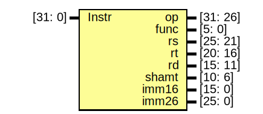

#### Ports

| Port name | Direction | Type     | Description          |
| --------- | --------- | -------- | -------------------- |
| Instr     | input     | [31: 0]  | Instruction          |
| op        | output    | [31: 26] | Opcode               |
| func      | output    | [5: 0]   | Function             |
| rs        | output    | [25: 21] | Source Register 1    |
| rt        | output    | [20: 16] | Source Register 2    |
| rd        | output    | [15: 11] | Destination Register |
| shamt     | output    | [10: 6]  | Shift Amount         |
| imm16     | output    | [15: 0]  | Immediate 16 bits    |
| imm26     | output    | [25: 0]  | Immediate 26 bits    |

### Entity: F_IFU

- **File**: F_IFU.v

#### Diagram

#### Ports

| Port name | Direction | Type    | Description     |
| --------- | --------- | ------- | --------------- |
| clk       | input     |         | Clock           |
| reset     | input     |         | Reset           |
| WE        | input     |         | Write Enable    |
| nPC       | input     | [31: 0] | Next PC         |
| Instr     | output    | [31: 0] | Instruction     |
| PC        | output    | [31: 0] | Program Counter |

#### Processes

- unnamed: ( @(posedge clk) )
  - **Type:** always

### Entity: D_REG

- **File**: D_REG.v

#### Diagram

#### Ports

| Port name | Direction | Type    | Description         |
| --------- | --------- | ------- | ------------------- |
| clk       | input     |         | Clock               |
| reset     | input     |         | Reset               |
| WE        | input     |         | Write Enable        |
| PC_in     | input     | [31: 0] | F_Stage PC          |
| Instr_in  | input     | [31: 0] | F_Stage Instruction |
| PC_out    | output    | [31: 0] | D_Stage PC          |
| Instr_out | output    | [31: 0] | D_Stage Instruction |

#### Processes

- unnamed: ( @(posedge clk) )
  - **Type:** always

### Entity: D_CMP

- **File**: D_CMP.v

#### Diagram

#### Ports

| Port name | Direction | Type    | Description       |
| --------- | --------- | ------- | ----------------- |
| rs        | input     | [31: 0] | Source Register 1 |
| rt        | input     | [31: 0] | Source Register 2 |
| CMPType   | input     | [31: 0] | Compare Type      |
| isTrue    | output    |         | Is True           |

### Entity: D_EXT

- **File**: D_EXT.v

#### Diagram

#### Ports

| Port name | Direction | Type    | Description         |
| --------- | --------- | ------- | ------------------- |
| EXTOp     | input     | [31: 0] | Extension operation |
| imm16     | input     | [15: 0] | Immediate 16 bits   |
| EXTOut    | output    | [31: 0] | Extended output     |

### Entity: D_GRF

- **File**: D_GRF.v

#### Diagram

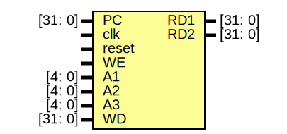

#### Ports

| Port name | Direction | Type    | Description       |
| --------- | --------- | ------- | ----------------- |
| PC        | input     | [31: 0] | Program Counter   |
| clk       | input     |         | Clock             |
| reset     | input     |         | Reset             |
| WE        | input     |         | Write Enable      |
| A1        | input     | [4: 0]  | Source Register 1 |
| A2        | input     | [4: 0]  | Source Register 2 |
| A3        | input     | [4: 0]  | Write Register    |
| WD        | input     | [31: 0] | Write Data        |
| RD1       | output    | [31: 0] | Read Data 1       |
| RD2       | output    | [31: 0] | Read Data 2       |

#### Signals

| Name | Type        | Description   |
| ---- | ----------- | ------------- |
| RF   | reg [31: 0] | Register File |
| i    | integer     | Loop Variable |

#### Processes

- RegWrite: ( @(posedge clk) )
  - **Type:** always

### Entity: D_NPC

- **File**: D_NPC.v

#### Diagram

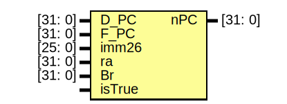

#### Ports

| Port name | Direction | Type    | Description                  |
| --------- | --------- | ------- | ---------------------------- |
| D_PC      | input     | [31: 0] | Decode_Stage Program Counter |
| F_PC      | input     | [31: 0] | Fetch_Stage Program Counter  |
| imm26     | input     | [25: 0] | Immediate 26 bits            |
| ra        | input     | [31: 0] | Return Address               |
| Br        | input     | [31: 0] | Branch                       |
| isTrue    | input     |         | Is True                      |
| nPC       | output    | [31: 0] | Next Program Counter         |

### Entity: E_REG

- **File**: E_REG.v

#### Diagram

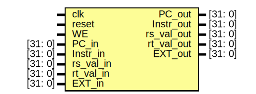

#### Ports

| Port name  | Direction | Type    | Description         |
| ---------- | --------- | ------- | ------------------- |
| clk        | input     |         | Clock               |
| reset      | input     |         | Reset               |
| WE         | input     |         | Write Enable        |
| PC_in      | input     | [31: 0] | D_Stage PC          |
| Instr_in   | input     | [31: 0] | D_Stage Instruction |
| rs_val_in  | input     | [31: 0] | D_Stage rs value    |
| rt_val_in  | input     | [31: 0] | D_Stage rt value    |
| EXT_in     | input     | [31: 0] | D_Stage EXT result  |
| PC_out     | output    | [31: 0] | E_Stage PC          |
| Instr_out  | output    | [31: 0] | E_Stage Instruction |
| rs_val_out | output    | [31: 0] | E_Stage rs value    |
| rt_val_out | output    | [31: 0] | E_Stage rt value    |
| EXT_out    | output    | [31: 0] | E_Stage EXT result  |

#### Processes

- unnamed: ( @(posedge clk) )
  - **Type:** always

### Entity: E_ALU

- **File**: E_ALU.v

#### Diagram

#### Ports

| Port name | Direction | Type    | Description   |
| --------- | --------- | ------- | ------------- |
| ALUOp     | input     | [31: 0] | ALU Operation |
| A         | input     | [31: 0] | A input       |
| B         | input     | [31: 0] | B input       |
| shamt     | input     | [5: 0]  | Shift Amount  |
| ALUOut    | output    | [31: 0] | ALU Output    |

# Entity: E_MDU

- **File**: E_MDU.v

## Diagram

## Ports

| Port name | Direction | Type    | Description |
| --------- | --------- | ------- | ----------- |
| clk       | input     |         |             |
| reset     | input     |         |             |
| MDUOp     | input     | [31: 0] |             |
| rs        | input     | [31: 0] |             |
| rt        | input     | [31: 0] |             |
| Busy      | output    |         |             |
| MDUOut    | output    | [31: 0] |             |

## Signals

| Name  | Type        | Description |
| ----- | ----------- | ----------- |
| state | integer     |             |
| start | wire        |             |
| hi    | reg [31: 0] |             |
| lo    | reg [31: 0] |             |

## Processes

- unnamed: ( @(posedge clk) )
  - **Type:** always

### Entity: M_REG

- **File**: M_REG.v

#### Diagram

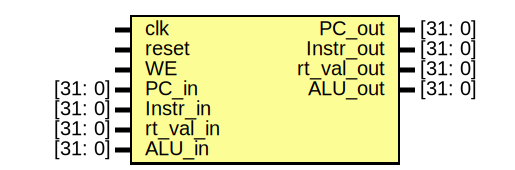

#### Ports

| Port name  | Direction | Type    | Description         |
| ---------- | --------- | ------- | ------------------- |
| clk        | input     |         | Clock               |
| reset      | input     |         | Reset               |
| WE         | input     |         | Write Enable        |
| PC_in      | input     | [31: 0] | E_Stage PC          |
| Instr_in   | input     | [31: 0] | E_Stage Instruction |
| rt_val_in  | input     | [31: 0] | E_Stage rt value    |
| ALU_in     | input     | [31: 0] | E_Stage ALU result  |
| PC_out     | output    | [31: 0] | M_Stage PC          |
| Instr_out  | output    | [31: 0] | M_Stage Instruction |
| rt_val_out | output    | [31: 0] | M_Stage rt value    |
| ALU_out    | output    | [31: 0] | M_Stage ALU result  |

#### Processes

- unnamed: ( @(posedge clk) )
  - **Type:** always

### Entity: M_DM

- **File**: M_DM.v

#### Diagram

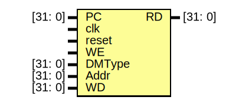

#### Ports

| Port name | Direction | Type    | Description      |
| --------- | --------- | ------- | ---------------- |
| PC        | input     | [31: 0] | Program Counter  |
| clk       | input     |         | Clock            |
| reset     | input     |         | Reset            |
| WE        | input     |         | Write Enable     |
| DMType    | input     | [31: 0] | Data Memory Type |
| Addr      | input     | [31: 0] | Address          |
| WD        | input     | [31: 0] | Write Data       |
| RD        | output    | [31: 0] | Read Data        |

#### Signals

| Name | Type        | Description |
| ---- | ----------- | ----------- |
| DM   | reg [31: 0] |             |
| i    | integer     |             |

#### Processes

- MemWrite: ( @(posedge clk) )
  - **Type:** always

### Entity: W_REG

- **File**: W_REG.v

#### Diagram

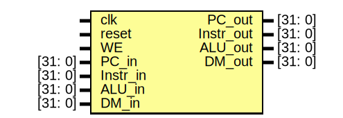

#### Ports

| Port name | Direction | Type    | Description |
| --------- | --------- | ------- | ----------- |
| clk       | input     |         |             |
| reset     | input     |         |             |
| WE        | input     |         |             |
| PC_in     | input     | [31: 0] |             |
| Instr_in  | input     | [31: 0] |             |
| ALU_in    | input     | [31: 0] |             |
| DM_in     | input     | [31: 0] |             |
| PC_out    | output    | [31: 0] |             |
| Instr_out | output    | [31: 0] |             |
| ALU_out   | output    | [31: 0] |             |
| DM_out    | output    | [31: 0] |             |

#### Processes

- unnamed: ( @(posedge clk) )
  - **Type:** always

### Entity: HU

- **File**: _HU.v

#### Diagram

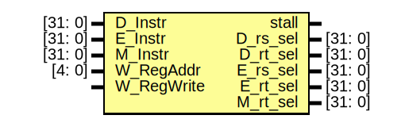

#### Ports

| Port name  | Direction | Type    | Description                  |
| ---------- | --------- | ------- | ---------------------------- |
| D_Instr    | input     | [31: 0] | Decode_Stage Instruction     |
| E_Instr    | input     | [31: 0] | Execute_Stage Instruction    |
| M_Instr    | input     | [31: 0] | Memory_Stage Instruction     |
| W_RegAddr  | input     | [4: 0]  | Write_Stage Register Address |
| W_RegWrite | input     |         | Write_Stage Register Write   |
| stall      | output    |         | Stall                        |
| D_rs_sel   | output    | [31: 0] | Decode_Stage rs_select       |
| D_rt_sel   | output    | [31: 0] | Decode_Stage rt_select       |
| E_rs_sel   | output    | [31: 0] | Execute_Stage rs_select      |
| E_rt_sel   | output    | [31: 0] | Execute_Stage rt_select      |
| M_rt_sel   | output    | [31: 0] | Memory_Stage rt_select       |

#### Signals

| Name       | Type         | Description                                |
| ---------- | ------------ | ------------------------------------------ |
| Tuse_rs    | wire [2: 0]  | Temporary use                              |
| Tuse_rt    | wire [2: 0]  | Temporary use                              |
| Tnew_E     | wire [2: 0]  | Temporary new                              |
| Tnew_M     | wire [2: 0]  | Temporary new                              |
| D_rs       | wire [4: 0]  | Decode_Stage rs, rt                        |
| D_rt       | wire [4: 0]  | Decode_Stage rs, rt                        |
| D_cal_r    | wire         | Decode_Stage calculate                     |
| D_cal_i    | wire         | Decode_Stage calculate                     |
| D_load     | wire         | Decode_Stage calculate                     |
| D_store    | wire         | Decode_Stage calculate                     |
| D_branch   | wire         | Decode_Stage calculate                     |
| D_jr       | wire         | Decode_Stage calculate                     |
| D_Br       | wire [31: 0] | Decode_Stage Branch                        |
| D_op       | wire [6: 0]  | Decode_Stage opcode, function              |
| D_func     | wire [6: 0]  | Decode_Stage opcode, function              |
| E_RegDst   | wire [31: 0] | Execute_Stage Register Destination         |
| E_RegAddr  | wire [4: 0]  | Execute_Stage Register Address, rs, rt, rd |
| E_rs       | wire [4: 0]  | Execute_Stage Register Address, rs, rt, rd |
| E_rt       | wire [4: 0]  | Execute_Stage Register Address, rs, rt, rd |
| E_rd       | wire [4: 0]  | Execute_Stage Register Address, rs, rt, rd |
| E_cal_r    | wire         | Execute_Stage calculate                    |
| E_cal_i    | wire         | Execute_Stage calculate                    |
| E_load     | wire         | Execute_Stage calculate                    |
| E_RegWrite | wire         | Execute_Stage calculate                    |
| E_op       | wire [6: 0]  | Execute_Stage opcode, function             |
| E_func     | wire [6: 0]  | Execute_Stage opcode, function             |
| stall_rs_E | wire         | Stall rs for Execute_Stage                 |
| stall_rt_E | wire         | Stall rt for Execute_Stage                 |
| M_RegDst   | wire [31: 0] | Memory_Stage Register Destination          |
| M_RegAddr  | wire [4: 0]  | Memory_Stage Register Address, rs, rt, rd  |
| M_rs       | wire [4: 0]  | Memory_Stage Register Address, rs, rt, rd  |
| M_rt       | wire [4: 0]  | Memory_Stage Register Address, rs, rt, rd  |
| M_rd       | wire [4: 0]  | Memory_Stage Register Address, rs, rt, rd  |
| M_load     | wire         | Memory_Stage load                          |
| M_RegWrite | wire         | Memory_Stage load                          |
| M_op       | wire [6: 0]  | Memory_Stage opcode, function              |
| M_func     | wire [6: 0]  | Memory_Stage opcode, function              |
| stall_rs_M | wire         | Stall rs for Memory_Stage                  |
| stall_rt_M | wire         | Stall rt for Memory_Stage                  |

#### Instantiations

- H_D_SPLT: SPLT
- H_D_CU: CU
- H_E_SPLT: SPLT
- H_E_CU: CU
- H_M_SPLT: SPLT
- H_M_CU: CU
